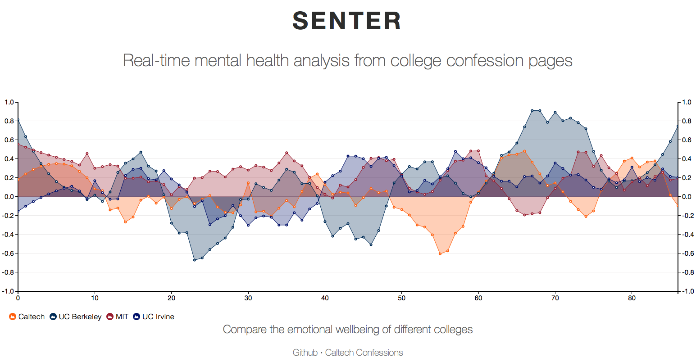

# Senter

## Inspiration
"Caltech Confessions" and similar confession pages at other universities provide public platforms for anonymous community members to express whatever they like, from humor to gratitude to deep secrets. When change happens on campus, like when the new Hameetman student center opened, we find ourselves scrolling through Caltech Confessions to see the reactions of our peers.

More importantly, Caltech can be a very stressful place, and mental health is a key concern. Since the posts on Caltech Confessions represent community sentiments, we were curious about how they can inform us about students’ well-being at Caltech and at peer institutions. 

## What it does
Senter conducts sentiment analysis on recent posts from confession pages. It produces a metric of mental health/emotional well-being of students that arises from the general sentiment of recent posts. This is visualized across time, and we provide a tool to easily compare this metric with that of other schools.

## How we built it
We extrapolated data (i.e. confession posts with their timestamp) from public Facebook pages of 5 different universities and calculated sentiment scores using a state-of-the-art natural language processing algorithm, [Valence Aware Dictionary and sEntiment Reasoner (VADER) sentiment analysis](https://github.com/cjhutto/vaderSentiment). This algorithm builds a set of lexical features, which are combined with rules related to grammatical and syntactical conventions, to analyze sentiments and their intensity. We accounted for noise in the form of confessions with relatively neutral scores using a Savitzky–Golay filter. We plotted the scores using D3 and javascript, which are shown in the charts above.

## Challenges we ran into
**Parsing Confession Data**
We hoped to use the Facebook API as a more streamlined way to track the posts on confession pages, and garner other data such as comments, reactions, etc. rather than scraping the pages. This requires manual approval from Facebook due to recent privacy concerns (even though confessions pages are public pages!), so this wasn’t possible in the timeframe of the hackathon.

**JavaScript and Visualization**
None of us have ever made web apps for data visualization, so we spent too much time trying to understand how to do this.

## Accomplishments that we're proud of
We ran sentiment analysis on hundreds of confessions! Our graphs not only look nice but are also an effective visualization of emotional well-being among different schools across time, and we are excited about their implications in addressing the consistently relevant issue of mental health on campus.

## What we learned
We came in with little to no experience in sentiment analysis algorithms, scraping webpages, using the Facebook API, building webapps, visualizing data...36 hours and having read countless papers, Medium articles, and Stack Overflow posts later, we have a much better idea of each of these domains.

## What's next for Senter

Our visualizations are also generalizable to other confession pages and other pages that are representative of crowd-sourced data.

We hope to correlate these trends with events in the community, which can range in breadth from exam periods and administrative decisions to parties. Our data could also be of use to administration as a gauge of student wellbeing.
